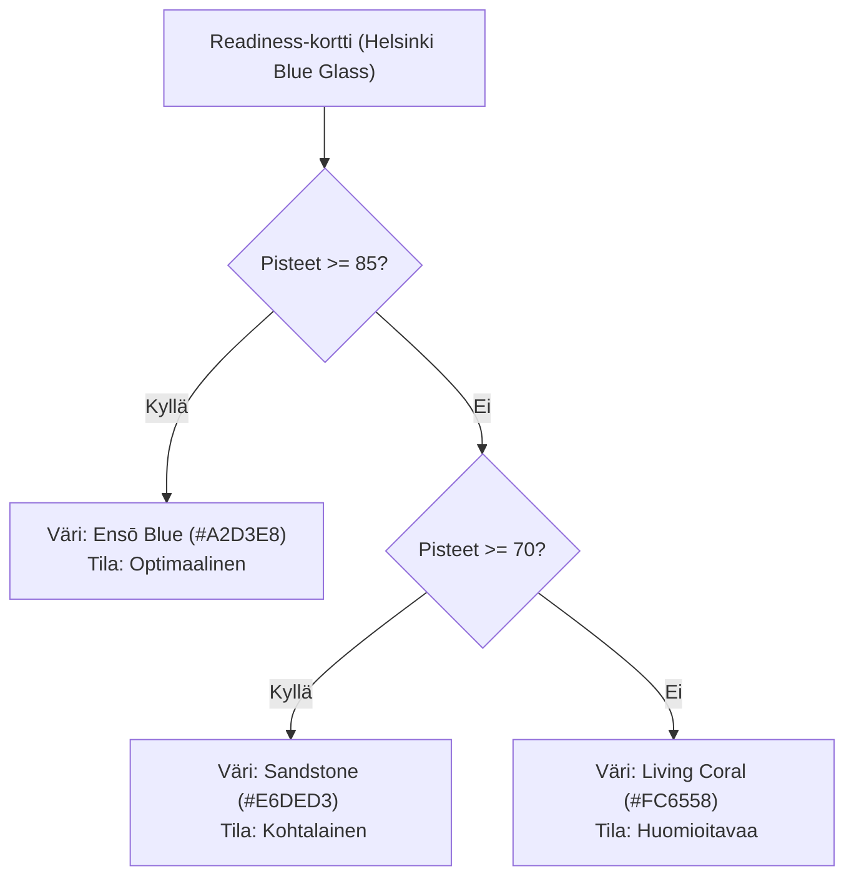
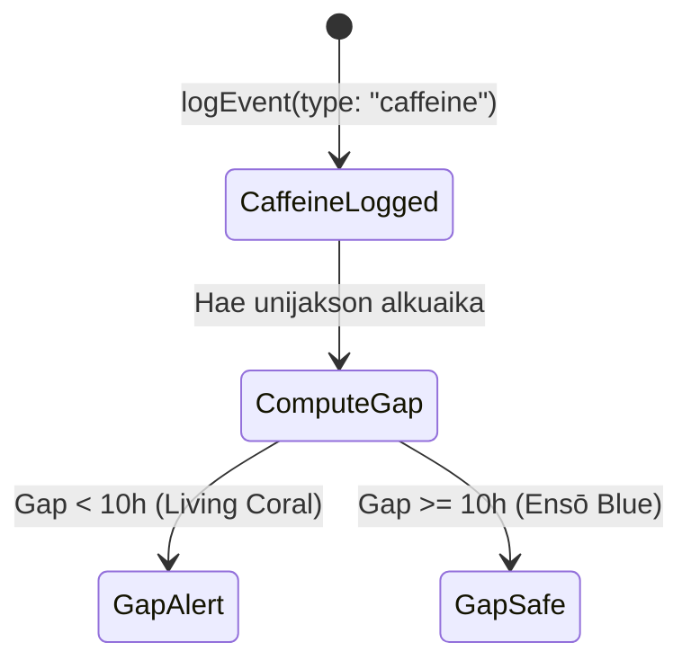

# Oura Weekly Cycle PWA — Graafiset Use Case -kuvaukset (MVP)

Tämä dokumentti kuvaa graafisesti ja teknisesti 15 heti toteutettavaa toimintoa, jotka hyödyntävät `weekly-cycle-oura-skill`-datakerrosta GraphQL-rajapinnan kautta. 

Käyttöliittymä noudattaa [weekly-cycle-oura-web](file:///Users/jaakkokorhonen/uutisseuranta/weekly-cycle-oura-web)-projektin mukaista visuaalista linjaa:
*   **Tausta:** Oura Black (`#151619`)
*   **Kortit ja pinnat:** Helsinki Blue Glass (`rgba(47, 74, 115, 0.15)`)
*   **Reunukset:** Sandstone Border (`rgba(230, 222, 211, 0.15)`)
*   **Uni / Palautuminen / Korostus:** Ensō Blue (`#A2D3E8`)
*   **Valmius / Tekstit:** Sandstone (`#E6DED3` / `#a09b95`)
*   **Stressi / Aktiivisuus / Kuorma:** Living Coral (`#FC6558`)

---

## 1. Käyttöliittymän arkkitehtuuri & tiedonkulku

Tässä kaaviossa kuvataan, miten PWA-sovellus kommunikoi GraphQL-rajapinnan kanssa heti toteutettavissa toiminnoissa.

```mermaid
sequenceDiagram
    autonumber
    participant PWA as PWA Frontend (Helsinki Blue Glass)
    participant GQL as GraphQL Server
    participant Skill as weekly-cycle-oura-skill (Engine)
    participant DB as Firestore / JSON Records

    rect rgb(28, 29, 34)
        Note over PWA, DB: Päiväkohtaisen tilan haku (Query)
        PWA->>GQL: getDayRecord(date: "2026-07-20")
        GQL->>DB: Hae rikastettu DayRecord
        DB-->>GQL: DayRecord (status, cycleState, metricsJson)
        GQL-->>PWA: getDayRecord vastaus
    end

    rect rgb(21, 22, 25)
        Note over PWA, DB: Manuaalinen kirjaus (Mutation)
        PWA->>GQL: logEvent(type: caffeine, amount: 100, note: "Espresso")
        GQL->>Skill: log_event() + Suorita rikastusputki
        Skill->>DB: Päivitä DayRecord & Event-loki
        GQL-->>PWA: Event luotu (päivitä käyttöliittymä)
    end
```



---

## 2. Graafiset use case -kuvaukset (15 toimintoa)

### A. Palautumisen & valmiuden seuranta (Toiminnot 1–2)

#### 1. Readiness-kortti (Valmiuspisteet)
*   **Kuvaus:** Näyttää päivän kokonaisvalmiuden ja sen tilan (esim. *Optimaalinen*, *Kohtalainen*, *Huomioitavaa*).
*   **Visualisointi:** Glassmorphism-kortti, jossa iso ympyräkaavio (Ensō Blue tai Living Coral kuormituksen mukaan).
*   **Data:** `DayRecord.status` ja `metricsJson.readiness_score`.



#### 2. Readiness Contributors (Valmiustekijät)
*   **Kuvaus:** Listaa keskeiset fysiologiset tekijät (leposyke, HRV-tasapaino, kehon lämpötila, edellisen päivän kuormitus).
*   **Visualisointi:** Vaakasuuntaiset palkit tai pisteytysasteikot kortin sisällä.
*   **Data:** `DayRecord.metricsJson.contributors` (esim. `hrv_balance`, `temperature_deviation`).

---

### B. Uni & yöpalautuminen (Toiminnot 3–8)

Seuraavat 6 toimintoa muodostavat uniosion ytimen, joka visualisoidaan yhtenäisenä "Sleep Analysis" -elementtinä.

```
+-------------------------------------------------------------+
| UNEN YHTEENVETO (Sleep Summary Card)                       |
| Total: 7h 45m [Ensō Blue] | Efficiency: 92% | HRV: 68 ms    |
+-------------------------------------------------------------+
| STAGES DISTRIBUTION (Donut Chart)                           |
| [=== REM 20% ===] [====== Deep 25% ======] [== Light 47% ==]|
+-------------------------------------------------------------+
| NIGHTLY HRV TREND (Line Chart)                              |
| 80 ms |      .-.                                            |
| 60 ms |  _.-'   '-._  (Min leposyke: 48 bpm)                |
+-------------------------------------------------------------+
```

#### 3. Kokonaiskesto (Sleep Duration)
*   **Kuvaus:** Kokonaisuniaika suhteessa henkilökohtaiseen tavoitteeseen.
*   **Query:** `getDayRecord(date)` -> `metrics.sleep.duration`.

#### 4. Sleep Efficiency (Unitehokkuus)
*   **Kuvaus:** Prosenttiosuus sängyssä vietetystä ajasta, joka oli todellista unta.
*   **Query:** `getDayRecord(date)` -> `metrics.sleep.efficiency` (%).

#### 5. REM-uni
*   **Kuvaus:** REM-univaiheen kesto ja laatuosuus.
*   **Query:** `getDayRecord(date)` -> `metrics.sleep.rem_sleep_duration`.

#### 6. Syvä uni (Deep Sleep)
*   **Kuvaus:** Syvän unen kesto (fysiologisen korjauksen kannalta tärkein vaihe).
*   **Query:** `getDayRecord(date)` -> `metrics.sleep.deep_sleep_duration`.

#### 7. Yönaikainen HRV-trendi
*   **Kuvaus:** Sykevälivaihtelun kulku yön aikana. Auttaa tunnistamaan alkoholin tai myöhäisen ruokailun vaikutukset.
*   **Visualisointi:** Google Charts -viivakaavio Ensō Blue -värillä.

#### 8. Alin leposyke (Resting HR)
*   **Kuvaus:** Yön alin syke ja sen ajoitus unijakson aikana.
*   **Query:** `getDayRecord(date)` -> `metrics.sleep.lowest_heart_rate`.

---

### C. Käyttäjän tapahtumat & johdetut ikkunat (Toiminnot 9–14)

Nämä toiminnot yhdistävät manuaaliset kirjaukset Oura-dataan.

#### 9. Kofeiini-ikkuna gap-näytöllä
*   **Kuvaus:** Visualisoi ajan viimeisestä kofeiiniannoksesta nukahtamiseen.
*   **Visualisointi:** Aikajana, jossa kofeiinikuvake ja nukkumaanmenokuvake. Ikkuna väritetään punaiseksi (Living Coral), jos väli on alle 10 tuntia, ja siniseksi (Ensō Blue), jos se on riittävä.



#### 10. Alkoholi-tapahtuman kirjaus
*   **Kuvaus:** Käyttäjä kirjaa nautitut alkoholiannokset reaaliajassa tai jälkikäteen.
*   **Mutation:** `logEvent(type: "alcohol", amount: 3.0, note: "Saunakaljat")`.

#### 11. Alkoholin tulkinta & palautumisvaikutus
*   **Kuvaus:** Skill vertaa alkoholin määrää ja ajoitusta HRV-pudotukseen ja leposykkeen nousuun.
*   **Visualisointi:** Vaikutuskortti (esim. *"Alkoholi viivästytti leposykkeen laskua 3 tunnilla ja laski HRV:tä 25%"*).

#### 12. Päiväunen kirjaus (Nap Logging)
*   **Kuvaus:** Päiväunien kirjaaminen ja niiden keston seuranta.
*   **Mutation:** `logEvent(type: "nap", duration_min: 20)`.

#### 13. Päiväunen vaikutus univelkaan (Nap Recovery Helper)
*   **Kuvaus:** Osoittaa, miten päiväuni paikkasi univelkaa ilman, että se häiritsee seuraavaa yöunta (jos ajoitettu ennen klo 15:00).

#### 14. Recovery Cost -pisteet
*   **Kuvaus:** Skillin laskema kokonaiskuormituspistemäärä päivälle manuaalisten rasitustekijöiden perusteella.
*   **Data:** `DayRecord.metricsJson.recovery_cost`.

---

### D. Viikkorytmin analyysi (Toiminto 15)

#### 15. Viikonloppusykli (La/Su/Ma-vertailu)
*   **Kuvaus:** Visualisoi viikonlopun siirtymän vaikutuksen fysiologiaan (lauantain kuormitus, sunnuntain korjausuni ja maanantain käynnistymisvalmius).
*   **Visualisointi:** Kolmipalkkinen vertailukortti (Lauantai vs Sunnuntai vs Maanantai).

```
+-------------------------------------------------------------+
| VIIKKONLOPPUSYKLI (La/Su/Ma)                                |
|                                                             |
| Lauantai (Aktiivinen)   | [======== 85 ] (Living Coral)     |
| Sunnuntai (Palautuminen)| [============= 92 ] (Ensō Blue)   |
| Maanantai (Tulos)       | [====== 74 ] (Sandstone)          |
+-------------------------------------------------------------+
```
*   **Query:** `getEventsRange(start, end)` ja `getDayRecord` viikonlopun päiviltä.

---

## 3. PWA-ruudun layout-malli (Lankaversio)

Tämä lankaversio havainnollistaa, miten yllä olevat 15 toimintoa sijoittuvat näytölle [weekly-cycle-oura-web](file:///Users/jaakkokorhonen/uutisseuranta/weekly-cycle-oura-web)-tyyleillä:

```
+-------------------------------------------------------------+
|  Oura Weekly Cycle PWA [Ensō Blue Ring]     User: jaakko    |
+-------------------------------------------------------------+
|  [30 pv] [90 pv] [180 pv]             Päivämäärä: 2026-07-20|
+-------------------------------------------------------------+
|  VALMIUS (Readiness)  |  UNI (Sleep)   |  RECOVERY COST     |
|       82              |    7h 45m      |       12 pts       |
|    Sandstone          |   Ensō Blue    |    Living Coral    |
+-------------------------------------------------------------+
|  TAPAHTUMIEN KIRJAUS (Fast Log Buttons)                     |
|  [ + Kahvi ]   [ + Alkoholi ]   [ + Päiväunet ]             |
+-------------------------------------------------------------+
|  KOFEIINI-IKKUNA (Caffeine Sleep Gap)                       |
|  Kahvi 14:00 ====> ( Gap: 9.5h ) ====> Uni 23:30            |
|  [ Status: Huomioitavaa - Living Coral ]                     |
+-------------------------------------------------------------+
|  KAAVIOT (Tabs: Overview / Sleep / Cycle)                   |
|  +-------------------------------------------------------+  |
|  | HRV Yötrendi vs Leposyke (Google Charts)              |  |
|  |                                                       |  |
|  +-------------------------------------------------------+  |
+-------------------------------------------------------------+
```
