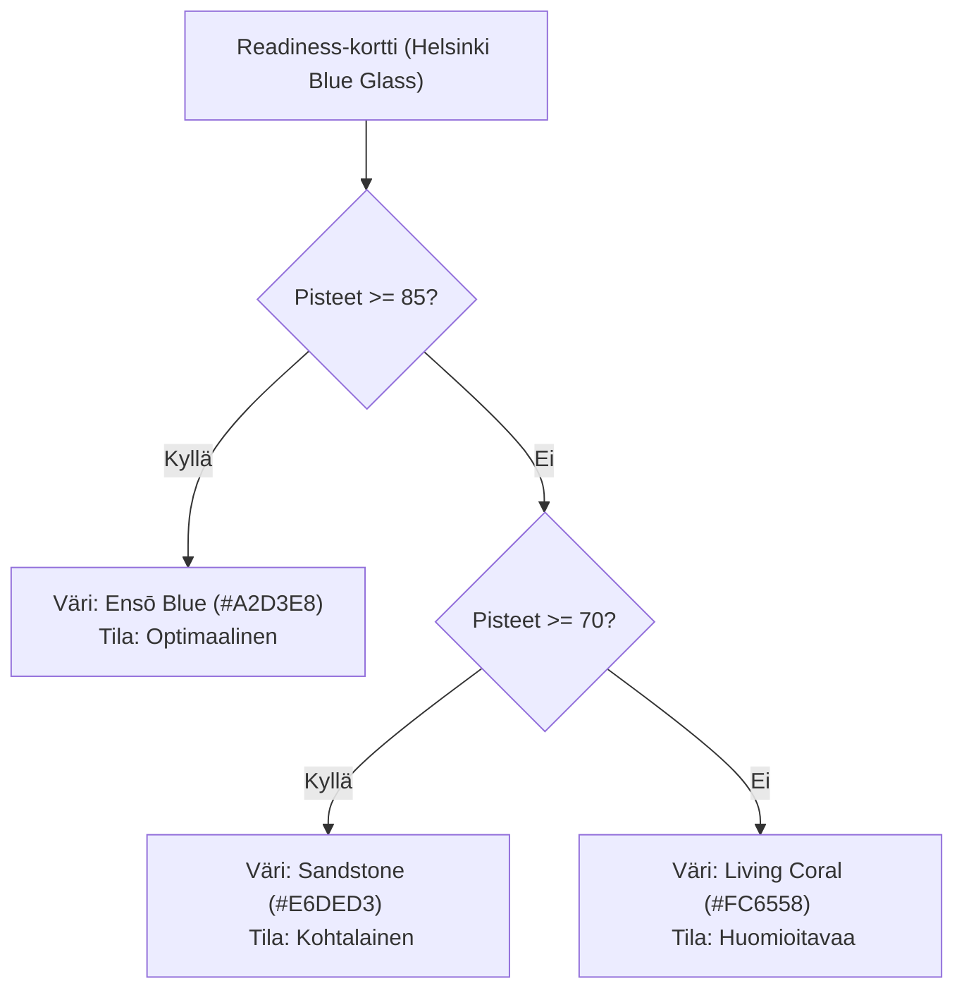
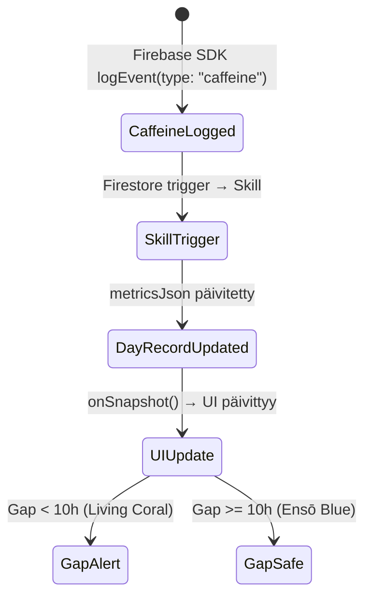

# Oura Weekly Cycle PWA — Graafiset Use Case -kuvaukset (MVP)

Tämä dokumentti kuvaa graafisesti ja teknisesti 15 + 1 heti toteutettavaa toimintoa, jotka hyödyntävät `weekly-cycle-oura-skill`-datakerrosta **Firebase GraphQL -rajapinnan** kautta.

Käyttöliittymä noudattaa [weekly-cycle-oura-web](file:///Users/jaakkokorhonen/uutisseuranta/weekly-cycle-oura-web)-projektin mukaista visuaalista linjaa:
*   **Tausta:** Oura Black (`#151619`)
*   **Kortit ja pinnat:** Helsinki Blue Glass (`rgba(47, 74, 115, 0.15)`)
*   **Reunukset:** Sandstone Border (`rgba(230, 222, 211, 0.15)`)
*   **Uni / Palautuminen / Korostus:** Ensō Blue (`#A2D3E8`)
*   **Valmius / Tekstit:** Sandstone (`#E6DED3` / `#a09b95`)
*   **Stressi / Aktiivisuus / Kuorma:** Living Coral (`#FC6558`)

---

## 1. Käyttöliittymän arkkitehtuuri & tiedonkulku

### Hybridi-malli: Firebase SDK kirjauksiin, Apollo lukuihin

> **localStorage ei käytössä.** Kaikki persistointi IndexedDB:n kautta (Firebase SDK + apollo3-cache-persist).
> **MQTT ei käytössä.** Reaaliaikaisuus toteutetaan Firestore `onSnapshot()`-kuuntelijoilla.
> **iOS Safari ei tueta.** Ks. README.

```mermaid
sequenceDiagram
    autonumber
    participant PWA as PWA Frontend (GitHub Pages)
    participant SDK as Firebase SDK (client)
    participant GQL as GraphQL API (Cloud Run / Apollo)
    participant Skill as weekly-cycle-oura-skill
    participant DB as Firestore

    rect rgb(28, 29, 34)
        Note over PWA, DB: Lukukyselyt (Query) — Apollo
        PWA->>GQL: getDayRecord(date: "2026-07-20")
        GQL->>DB: Hae esilaskettu DayRecord
        DB-->>GQL: DayRecord (status, cycleState, metricsJson)
        GQL-->>PWA: Vastaus (apollo3-cache-persist tallentaa IndexedDB:hen)
    end

    rect rgb(21, 22, 25)
        Note over PWA, DB: Kirjaukset (Mutation) — Firebase SDK
        PWA->>SDK: logEvent(type: caffeine, amount: 100)
        SDK->>DB: addDoc(events) — offline: jonottaa IndexedDB:hen
        DB-->>Skill: Firestore trigger → rikastusputki
        Skill->>DB: Päivitä DayRecord & metricsJson
        DB-->>PWA: onSnapshot() → UI päivittyy automaattisesti
    end

    rect rgb(18, 28, 18)
        Note over PWA, DB: Offline-tila — Firebase SDK jonottaa
        PWA->>SDK: logEvent(type: alcohol, amount: 2)
        SDK->>SDK: IndexedDB-jono (automaattinen, ei SW-koodia)
        Note over SDK, DB: Yhteyden palatessa SDK synkronoi automaattisesti
        SDK->>DB: addDoc synkronoituu
        DB-->>Skill: Trigger → rikastusputki
    end
```



---

## 2. Graafiset use case -kuvaukset (16 toimintoa)

### A. Palautumisen & valmiuden seuranta (Toiminnot 1–2)

#### 1. Readiness-kortti (Valmiuspisteet)
*   **Kuvaus:** Näyttää päivän kokonaisvalmiuden ja sen tilan (esim. *Optimaalinen*, *Kohtalainen*, *Huomioitavaa*).
*   **Visualisointi:** Glassmorphism-kortti, jossa iso ympäräkaavio (Ensō Blue tai Living Coral kuormituksen mukaan).
*   **Tiedonhaku:** Apollo `getDayRecord(date)` → `status` ja `metricsJson.readiness_score`.



#### 2. Readiness Contributors (Valmiustekijät)
*   **Kuvaus:** Listaa keskeiset fysiologiset tekijät (leposyke, HRV-tasapaino, kehon lämpötila, edellisen päivän kuormitus).
*   **Visualisointi:** Vaakasuuntaiset palkit tai pisteytysasteikot kortin sisällä.
*   **Tiedonhaku:** Apollo `getDayRecord(date)` → `metricsJson.contributors`.

---

### B. Uni & yöpalautuminen (Toiminnot 3–8)

```
+-------------------------------------------------------------+
| UNEN YHTEENVETO (Sleep Summary Card)                       |
| Total: 7h 45m [Ensō Blue] | Efficiency: 92% | HRV: 68 ms    |
+-------------------------------------------------------------+
| STAGES DISTRIBUTION (Donut Chart)                           |
| [=== REM 20% ===] [====== Deep 25% ======] [== Light 47% ==]|
+-------------------------------------------------------------+
| NIGHTLY HRV TREND (Line Chart)                              |
| 80 ms |      .-.                                            |
| 60 ms |  _.-'   '-._  (Min leposyke: 48 bpm)                |
+-------------------------------------------------------------+
```

#### 3. Kokonaiskesto (Sleep Duration)
*   **Tiedonhaku:** Apollo `getDayRecord(date)` → `metricsJson.sleep.duration`.

#### 4. Sleep Efficiency (Unitehokkuus)
*   **Tiedonhaku:** Apollo `getDayRecord(date)` → `metricsJson.sleep.efficiency` (%).

#### 5. REM-uni
*   **Tiedonhaku:** Apollo `getDayRecord(date)` → `metricsJson.sleep.rem_sleep_duration`.

#### 6. Syvä uni (Deep Sleep)
*   **Tiedonhaku:** Apollo `getDayRecord(date)` → `metricsJson.sleep.deep_sleep_duration`.

#### 7. Yönaikainen HRV-trendi
*   **Visualisointi:** Google Charts -viivakaavio Ensō Blue -värillä.
*   **Tiedonhaku:** Apollo `getDayRecord(date)` → `metricsJson.hrv.items`.

#### 8. Alin leposyke (Resting HR)
*   **Tiedonhaku:** Apollo `getDayRecord(date)` → `metricsJson.sleep.lowest_heart_rate`.

---

### C. Käyttäjän tapahtumat & johdetut ikkunat (Toiminnot 9–14)

> Kirjaukset menevat Firebase SDK:n kautta Firestoreen (offline-tuki automaattinen). Lukukyselyt Apollo-kautta.

#### 9. Kofeiini-ikkuna gap-näytöllä



#### 10. Alkoholi-tapahtuman kirjaus
*   **Kirjaus:** Firebase SDK `addDoc(events, { type: 'alcohol', amount: 3.0, note: 'Saunakaljat' })`

#### 11. Alkoholin tulkinta & palautumisvaikutus
*   **Tiedonhaku:** Apollo `getDayRecord(date)` → `metricsJson` (sisältää alkoholin fysiologiset korrelaatiot).

#### 12. Päiväunen kirjaus (Nap Logging)
*   **Kirjaus:** Firebase SDK `addDoc(events, { type: 'nap', amount: 20.0 })`

#### 13. Päiväunen vaikutus univelkaan
*   **Tiedonhaku:** Apollo `getDayRecord(date)` → `metricsJson.sleep.naps`.

#### 14. Recovery Cost -pisteet
*   **Tiedonhaku:** Apollo `getDayRecord(date)` → `metricsJson.recovery_cost`.

---

### D. Viikkorytmin analyysi & synkronointi (Toiminnot 15–16)

#### 15. Viikonloppusykli (La/Su/Ma-vertailu)
*   **Tiedonhaku:** Apollo `getEventsRange(start, end)` + `getDayRecord` viikonlopun ja maanantain päiviltä.

#### 16. Oura-tietojen synkronoinnin käynnistys PWA-sovelluksesta
*   **GraphQL Mutation (Apollo):**
    ```graphql
    mutation SyncOura($date: String!) {
      syncOuraData(date: $date) {
        date
        status
        cycleState
        metricsJson
      }
    }
    ```

---

## 3. PWA-ruudun layout-malli (Lankaversio)

```
+-------------------------------------------------------------+
|  Oura Weekly Cycle PWA [Ensō Blue Ring]     User: jaakko    |
|  [ Päivitä tiedot ] (Sync Button)                           |
+-------------------------------------------------------------+
|  [30 pv] [90 pv] [180 pv]             Päivämäärä: 2026-07-20|
+-------------------------------------------------------------+
|  VALMIUS (Readiness)  |  UNI (Sleep)   |  RECOVERY COST     |
|       82              |    7h 45m      |       12 pts       |
|    Sandstone          |   Ensō Blue    |    Living Coral    |
+-------------------------------------------------------------+
|  TAPAHTUMIEN KIRJAUS (Fast Log — Firebase SDK)              |
|  [ + Kahvi ]   [ + Alkoholi ]   [ + Päiväunet ]             |
|  (offline-tuki automaattinen, näkyy optimistic UI:ssa)      |
+-------------------------------------------------------------+
|  KOFEIINI-IKKUNA (Caffeine Sleep Gap)                       |
|  Kahvi 14:00 ====> ( Gap: 9.5h ) ====> Uni 23:30            |
|  [ Status: Huomioitavaa - Living Coral ]                     |
+-------------------------------------------------------------+
|  KAAVIOT (Tabs: Overview / Sleep / Cycle)                   |
|  +-------------------------------------------------------+  |
|  | HRV Yötrendi vs Leposyke (Apollo GraphQL)             |  |
|  | (onSnapshot päivittää automaattisesti)               |  |
|  +-------------------------------------------------------+  |
+-------------------------------------------------------------+
```
